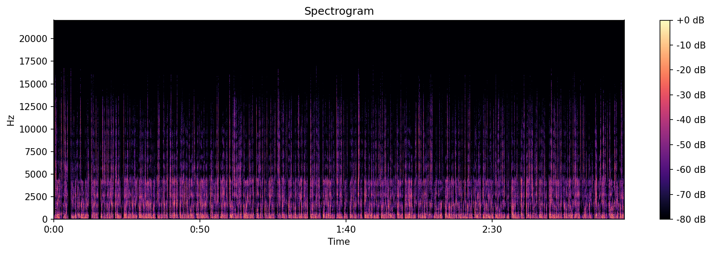
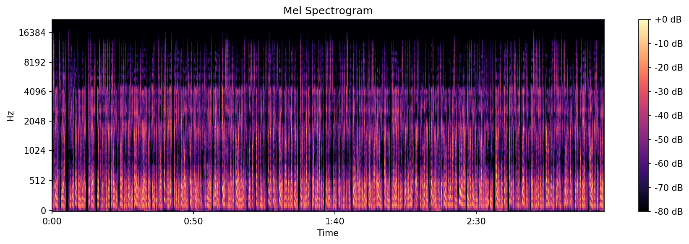
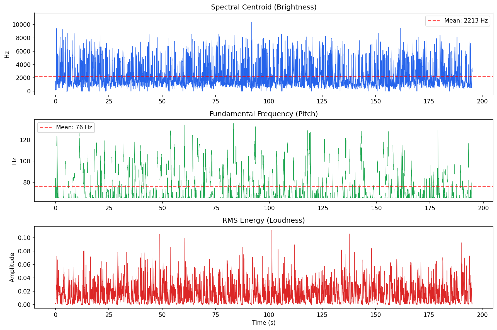

# AI-EQ-Assistant

AI-powered voice analysis tool that provides comprehensive EQ, compression, and post-processing recommendations for podcasters, voiceover artists, and audio engineers. Uses Google Gemini for intelligent analysis combined with librosa-based parametric audio metrics.

## Purpose

Creating consistent, professional-sounding voice recordings requires understanding your voice's unique characteristics. This tool provides **objective data** about your voice patterns to help you:

- Develop replicable EQ parameters across recording sessions
- Understand your voice's frequency profile and how it sits in different bands
- Get specific, actionable compression and processing recommendations
- Identify potential issues (boxiness, sibilance, muddiness) before they become problems

## How It Works

1. **Loudness Normalization** - Audio is normalized to -16 LUFS (podcast standard) to ensure consistent analysis regardless of recording levels
2. **Parametric Analysis** - librosa extracts detailed metrics about pitch, dynamics, spectral characteristics, and frequency band energy
3. **Spectrogram Generation** - Visual analysis with EQ frequency band overlays
4. **AI Analysis** - Google Gemini analyzes both the audio file AND the parametric data to provide intelligent, context-aware recommendations

## Installation

Requires Python 3.10+ and [uv](https://docs.astral.sh/uv/).

```bash
# Clone the repo
git clone https://github.com/danielrosehill/AI-EQ-Assistant.git
cd AI-EQ-Assistant

# Create virtual environment and install
uv venv .venv
source .venv/bin/activate
uv pip install -e .
```

## Configuration

Create a `.env` file with your Gemini API key:

```env
GEMINI_API_KEY=your_api_key_here
```

Get an API key from [Google AI Studio](https://aistudio.google.com/).

## Usage

### 1. Add Your Voice Sample

Place your voice recording in the `voice-samples/` folder:

```bash
mkdir -p voice-samples
cp /path/to/your/recording.mp3 voice-samples/
```

**Note:** The example voice sample included in this repo is for demonstration purposes. Replace it with your own recording for analysis.

### 2. Run the Analyzer

```bash
source .venv/bin/activate
python analyze_voice.py
```

If multiple samples exist, you'll be prompted to select one.

### 3. Review Your Results

Results are saved to the `analysis/` folder:

| File | Description |
|------|-------------|
| `voice_analysis_TIMESTAMP.md` | Full markdown report with all recommendations |
| `spectrogram_raw_TIMESTAMP.png` | Raw spectrogram visualization |
| `spectrogram_annotated_TIMESTAMP.png` | Spectrogram with EQ frequency band overlays |
| `parametric_data_TIMESTAMP.json` | Raw metrics for programmatic use |

## Supported Audio Formats

- MP3
- WAV
- FLAC
- OGG
- M4A
- AAC
- AIFF

## What You Get

### Parametric Analysis

Computed metrics include:

- **Speaking Rate** - Words per minute (WPM) estimation
- **Pitch/F0 Analysis** - Mean, median, range, and variability of fundamental frequency
- **Loudness & Dynamics** - RMS levels and dynamic range
- **Spectral Characteristics** - Centroid, bandwidth, and rolloff frequencies
- **Frequency Band Energy** - Energy distribution across EQ-relevant bands:
  - Sub-bass rumble (20-80 Hz)
  - Bass/Body (80-250 Hz)
  - Low-mids (250-500 Hz)
  - Midrange (500-2000 Hz)
  - Presence (2000-4000 Hz)
  - Brilliance (4000-8000 Hz)
  - High frequencies (8000-16000 Hz)

### Speech & Linguistic Analysis

- Accent identification and regional characteristics
- Pronunciation patterns and articulation quality
- Intonation and prosody analysis
- Speaking style and delivery assessment
- TTS/STT suitability evaluation

### Voice Quality Assessment

- **GRBAS Scale** - Clinical voice quality rating (Grade, Roughness, Breathiness, Asthenia, Strain)
- **MOS-Style Ratings** - Mean Opinion Score style ratings for listening effort, comprehension, naturalness, etc.

### Audio Engineering Recommendations

- **EQ Settings** - Specific parametric EQ recommendations with frequency, gain, and Q values
- **Compression** - Threshold, ratio, attack, release, and makeup gain
- **De-essing** - Target frequencies and intensity if sibilance is detected
- **High-pass Filter** - Cutoff frequency recommendations
- **Overall Quality Assessment** - Rating and best use cases for the voice

## Example Output

### Spectrograms

The tool generates multiple visualizations to help you understand your voice's frequency characteristics:

**Spectrogram:**



**Mel Spectrogram:**



**Frequency Analysis:**



### Sample Analysis Results

From a real voice analysis (see [full example report](analysis/1_analysis.pdf)):

#### Parametric Data

| Metric | Value |
|--------|-------|
| Mean F0 (Pitch) | 125.6 Hz |
| Pitch Range | 65.4 - 257.1 Hz |
| Speaking Rate | 212 WPM |
| Dynamic Range | 48.5 dB |
| Spectral Centroid | 2212.5 Hz |

#### EQ Recommendations

| Frequency (Hz) | Gain (dB) | Q/Bandwidth | Reasoning |
|----------------|-----------|-------------|-----------|
| 100-120 | -1.5 | 1.5-2.0 | Control fundamental boominess |
| 250-350 | -2.5 | 2.0-2.5 | Reduce boxiness and low-mid muddiness |
| 1500-2000 | +1.5 | 1.5-2.0 | Enhance intelligibility and presence |
| 4000-6000 | +2.0 | Shelf | Add 'air' and brilliance |

#### Compression Settings

| Parameter | Value |
|-----------|-------|
| Threshold | -20 dB |
| Ratio | 3.5:1 |
| Attack | 8-12 ms |
| Release | 80-120 ms |
| Makeup Gain | +4 to +6 dB |

## Use Cases

- **Podcasters** - Develop consistent EQ settings that work for your voice across episodes
- **Voiceover Artists** - Understand your voice's characteristics for different project types
- **Audio Engineers** - Get objective starting points for processing unfamiliar voices
- **Content Creators** - Improve audio quality with targeted, data-driven adjustments
- **Voice Actors** - Analyze different speaking styles and their acoustic properties
- **TTS Training** - Evaluate voice samples for text-to-speech training suitability

## Dependencies

| Package | Purpose |
|---------|---------|
| `google-genai` | Gemini API client for AI analysis |
| `librosa` | Audio analysis and feature extraction |
| `matplotlib` | Spectrogram visualization |
| `scipy` | Signal processing and filtering |
| `soundfile` | Audio file I/O |
| `rich` | Terminal UI and progress display |
| `python-dotenv` | Environment variable management |
| `numpy` | Numerical operations |

## Tips for Best Results

1. **Use a representative sample** - Record 30-60 seconds of natural speech (reading, conversational, or your typical recording style)
2. **Consistent recording setup** - Use the same mic and room you'll use for production
3. **Avoid processing** - Provide raw, unprocessed audio for the most accurate analysis
4. **Multiple samples** - Analyze different speaking styles (energetic, calm, reading vs. conversational) to understand your range

## License

MIT

---

*This tool was created to help creators understand their voice characteristics and develop consistent, professional-sounding audio.*
